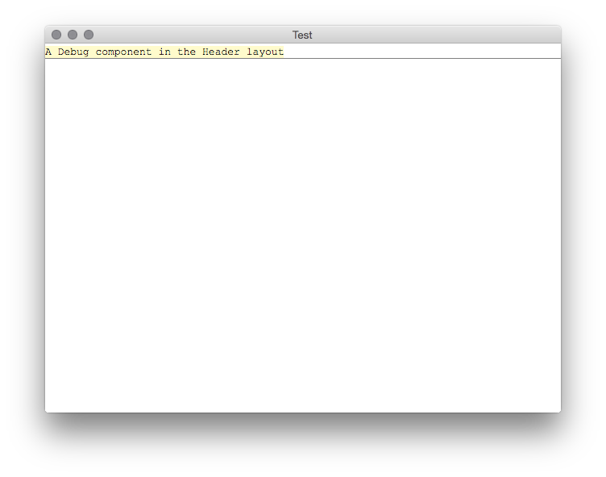

# Build Electron Applications with React, CJSX, and Sass

This repository is intended to act as scaffolding for Electron applications built on React and authored using CoffeeScript and Sass. CJSX, a CoffeeScript-friendly variant of JSX, is used for defining components.

The project draws heavily from  [Electron-React-Boilerplate](https://github.com/airtoxin/Electron-React-Boilerplate) by [Ryoji Ishii](https://github.com/airtoxin). JavaScript files have been converted into CoffeeScript and the Browserify task runs through a [coffee-reactify](https://github.com/jsdf/coffee-reactify) transform. The directory layout has been modified to provide a little more structure for new projects.

## Getting Started

Download and extract the latest release:

```
$ wget https://github.com/droptype/electron-react-cjsx-sass-boilerplate/archive/0.1.1.tar.gz
$ tar zxvf 0.1.1.tar.gz
$ cd electron-react-cjsx-sass-boilerplate
```

Install our development dependencies with `npm`:

```
$ npm install
```

Initiate build and watch for changes

```
$ npm start
```

Now you can navigate to the `./build/<version number>/darwin-x64/` and open _Electron.app_. You'll see something along the lines of this:


